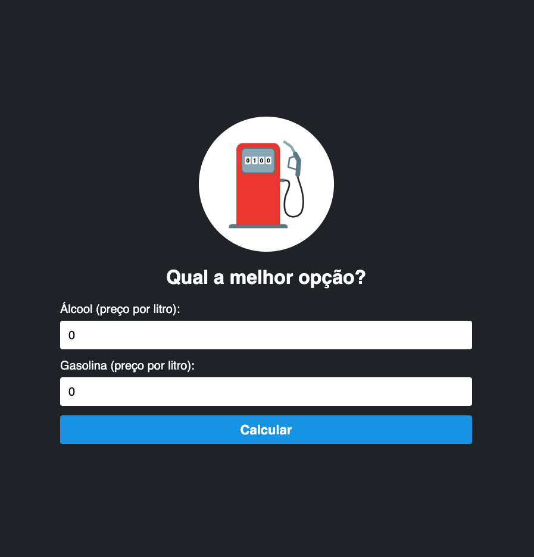
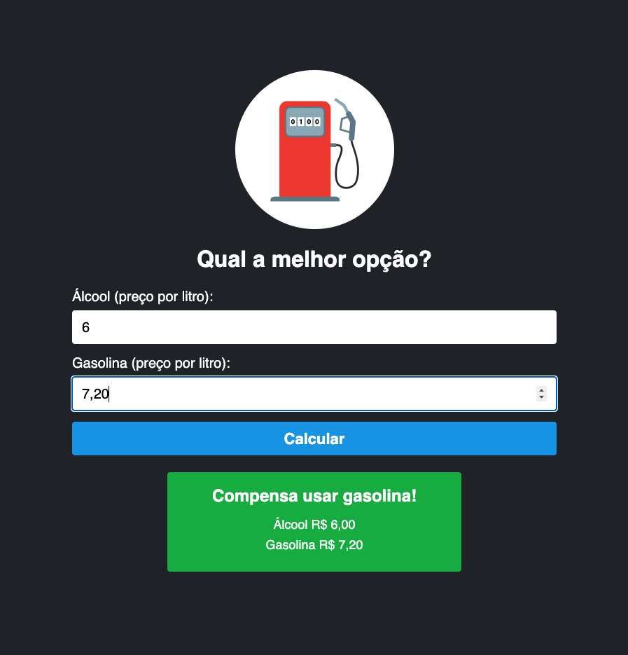

# 🛢️ Calculadora de Combustível

Projeto desenvolvido com React + TypeScript durante o curso **Fullstack Pro** do professor Matheus Fraga. A aplicação compara os preços do álcool e da gasolina para informar qual é mais vantajoso economicamente.

## 🚀 Funcionalidades

- Entrada do preço do álcool e gasolina por litro.
- Cálculo baseado na proporção de 0.7 (70%).
- Exibição do resultado com formatação em reais.
- Interface simples, responsiva e com visual intuitivo.

## 🧪 Tecnologias utilizadas

- React
- TypeScript
- CSS

## 📷 Captura de tela

## 📚 Aprendizados

- Esse projeto me ajudou a reforçar conceitos como:
- Manipulação de estado no React.
- Tipagem com TypeScript.
- Validação de formulário com required, min e step.
- Estilização com CSS puro.